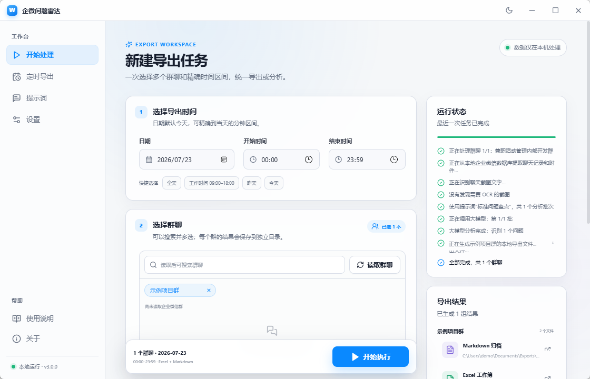
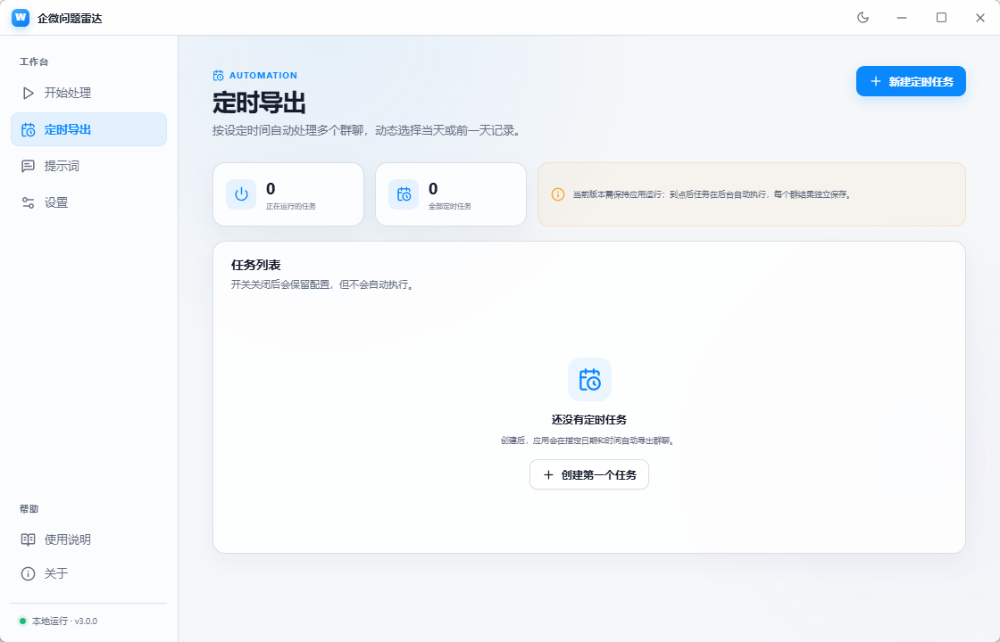
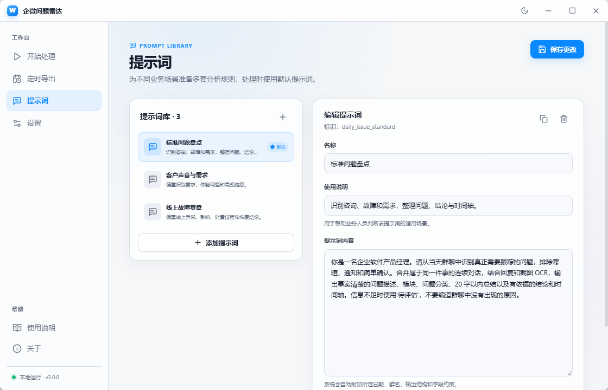
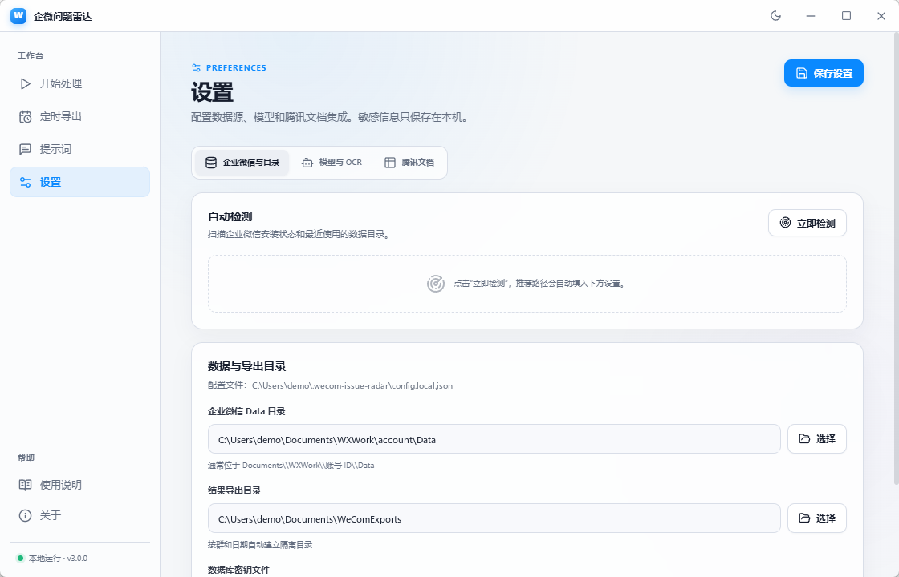

# 企微问题雷达

一个面向业务、产品和客户成功团队的 Windows 桌面工具：从本机企业微信群聊中提取指定日期与时间范围内的聊天记录和截图，通过可选的 OCR 与大模型分析整理问题，并导出 Excel、Markdown，或在二次确认后同步到腾讯文档 Smart Sheet。聊天数据、配置和处理中间结果均保留在本机。

当前桌面版使用 **Tauri 2 + Rust + React + TypeScript**，界面参考 cc-switch 的紧凑侧边导航、浅色/深色主题和玻璃卡片风格。聊天解密、OCR、模型调用和报表导出封装在随安装包分发的 Python sidecar 中，业务人员无需安装 Python、Node.js 或 Rust。

## 功能

- 自动检测企业微信是否运行、安装路径和数据目录
- 手动配置企业微信 `Data` 目录、数据库密钥和导出目录
- 读取本地数据库中的群聊列表，按起止日期、分钟级跨天区间和多个群处理
- 独立配置大模型与截图 OCR，包括 Base URL、API Key、模型和并发数
- 内置多套分析提示词，可为每套提示词定义独立的问题字段、类型、枚举和默认值
- 可以只导出原始聊天，也可以启用 OCR 和大模型问题提炼
- 同时支持 Excel、Markdown 和腾讯文档 Smart Sheet
- 支持多套腾讯文档模板和字段映射，写入前预览，并按模板跳过已取得远端记录 ID 的条目
- 可创建定时导出任务，配置执行时间、每周执行日、动态日期、多群和处理方式
- 自动保留“开始处理”页的上次选择、运行日志和最近一次导出结果
- 浅色/深色主题、无边框窗口和现代化任务进度界面

## 界面预览

### 开始处理

选择日期、分钟级时间范围和一个或多个群聊后即可执行任务。右侧会实时显示聊天读取、截图 OCR、模型分析和文件导出的进度，完成后可直接打开生成的 Markdown、Excel 或任务目录。



### 定时导出

按执行时间、每周执行日和动态日期创建自动导出任务；每个群聊独立保存结果。当前调度器随桌面应用运行，应用关闭后任务配置仍会保留，但不会在后台自动执行。



### 提示词管理

内置标准问题盘点、客户声音与需求、线上故障复盘等分析模板，也可以新增、复制、编辑、删除提示词并设置默认模板。每套提示词都能维护自己的问题清单字段、字段顺序、类型、枚举、默认值和提取说明，并可关联默认腾讯文档模板。



### 设置

设置页分为“企业微信与目录”“模型与 OCR”“腾讯文档”三部分。可自动检测企业微信安装状态和数据目录，也可以手动配置数据源、导出目录、模型服务、OCR 与 Smart Sheet 集成。“企业微信与目录”中的配置迁移工具可以备份或导入模型、OCR、腾讯文档、提示词和定时任务等业务配置。



## 导出结果是什么

### Excel（推荐给业务人员）

每个选中群聊分别生成一个 `.xlsx` 工作簿，包含三个 Sheet：

1. `导出说明`：处理日期、群名、生成时间和字段说明。
2. `聊天记录`：完整消息时间、发送人、消息类型、原文、截图 OCR、附件路径和消息 ID。
3. `问题清单`：按照本次分析使用的问题字段快照动态生成列，同时保留消息时间、发送人、图片引用和问题 Key。

Excel 适合筛选、排序、二次补充和交给业务团队流转。即使不配置大模型，也可以导出完整聊天记录。

### Markdown（推荐用于归档或交给其他 AI）

每个选中群聊同时可生成一个 `.md` 文件，按时间保留完整聊天上下文、截图 OCR 和结构化问题清单。它适合 Git/知识库归档、全文搜索，或者手动上传给其他大模型继续分析。

选择非全天范围时，Excel 和 Markdown 文件名会包含时间区间，例如 `2026-07-23_0915-1030_销售群_聊天与问题盘点.xlsx`，文件内容也会注明实际聊天范围，避免与全天结果混淆。

跨天范围会同时写入起止日期，例如 `2026-07-23_2300--2026-07-24_0100_销售群_聊天与问题盘点.xlsx`，并保存到 `2026-07-23_to_2026-07-24` 范围目录。

### 腾讯文档 Smart Sheet（可选）

Smart Sheet 同步的是大模型生成的结构化问题记录，而不是把整段聊天原样塞进表格。“设置 → 腾讯文档”可预先建立多套目标模板，为每套模板配置文档地址、Webhook、目标字段 Schema 以及来源字段映射。默认模板包括：

- 模块、问题描述、原因、问题截图
- 复盘结论、处理状态、问题分类、典型案例
- 登记日期、问题总结、起止时间、Jira 链接等

运行任务时可使用提示词关联的默认腾讯模板，也可临时切换。同步前会校验必填映射、来源与目标字段类型兼容性和枚举值；同一个问题可以分别同步到不同模板，已取得远端记录 ID 并写入本地台账的条目会按模板跳过。同步依赖腾讯侧可接收 `records` 的 Webhook；图片上传还需要企业微信 `Corp ID` 和应用 `Corp Secret`。未配置 Smart Sheet 时，Excel 和 Markdown 完全不受影响。

去重台账以腾讯接口返回的 `record_id` 为确认依据。如果远端已经写入，但应用在收到完整响应或保存本地台账前被中断，系统无法自动证明该条是否成功；此时应先在目标文档中人工核对，再决定是否重试，不能把本地台账视为严格的 exactly-once 保证。

## 使用流程

1. 安装并启动桌面应用。
2. 在“设置 → 企业微信与目录”中运行自动检测，确认数据目录和导出目录。
3. 首次使用时，在企业微信正在运行的情况下点击“提取密钥”。
4. 按需配置大模型、OCR，并在腾讯文档模板库中定义目标字段和映射。
5. 在“提示词”中选择或创建业务分析规则，维护对应的问题清单并按需关联腾讯模板。
6. 回到“开始处理”，选择开始/结束日期时间和一个或多个群聊，再选择 OCR、分析和导出方式。结束日期默认今天。
7. 任务结束后直接打开 Excel、Markdown 或完整任务目录。
8. 如果启用了 Smart Sheet，核对待写入数量后再次确认。

## 多群与定时导出

- 手动导出的开始、结束日期默认都是今天；可快速切换今天、昨天、昨天至今天、全天或工作时间，也可精确选择跨天范围。
- 离开“开始处理”页再返回或重新打开应用时，会恢复上次选择、运行日志和最近一次导出结果；尚未确认的腾讯文档结果可继续同步，旧文件被移动或删除时会给出简短提示。
- 群聊支持搜索、多选和全选当前搜索结果。系统按选择顺序处理，每个群独立保存目录和结果；单个群失败会明确返回错误，不会把不同群的数据混入同一个文件。
- “定时导出”可配置每天执行时间、周一至周日、动态当天、动态前一天或固定日期，以及时间区间、多群和处理方式。结束时间早于开始时间时按次日处理；跨夜动态任务应选择“执行前一天”，使结束时间落在任务执行当天。
- 当前版本的调度器运行在桌面应用内，因此到点时应用需要保持运行；电脑休眠或应用关闭而错过执行分钟时不会自动补跑。
- 定时任务启用 Smart Sheet 时只生成并持久化待同步预览，不会自动写入腾讯文档。之后可在“定时导出”页核对冻结的模板、群聊、文档地址和待写数量，再明确确认或放弃；同步失败的结果会保留以便重试。

## 本地开发

### 环境

- Windows 10/11
- Node.js 22+
- pnpm 10+
- Rust stable，包含 MSVC Windows target
- Python 3.11+

### 安装与运行

```powershell
pnpm install
python -m venv .venv
.\.venv\Scripts\python.exe -m pip install -r requirements.txt
pnpm tauri:dev
```

开发模式下 Rust 会调用 `.venv\Scripts\python.exe worker\main.py`。发布版本则调用 Tauri 安装包内的 `wecom-issue-radar-worker.exe`。

### 验证

```powershell
pnpm typecheck
pnpm build:renderer
.\.venv\Scripts\python.exe -m unittest discover -s tests -v
cargo fmt --manifest-path src-tauri\Cargo.toml --check
cargo clippy --manifest-path src-tauri\Cargo.toml --all-targets -- -D warnings
```

## Windows 打包

Python 处理引擎必须先构建为 Tauri sidecar：

```powershell
.\.venv\Scripts\python.exe -m pip install pyinstaller
.\.venv\Scripts\pyinstaller.exe --clean --noconfirm worker\issue_radar_worker.spec
New-Item -ItemType Directory -Force src-tauri\binaries
Copy-Item dist\wecom-issue-radar-worker.exe src-tauri\binaries\wecom-issue-radar-worker-x86_64-pc-windows-msvc.exe
pnpm tauri build --target x86_64-pc-windows-msvc
```

安装包位于：

- `src-tauri/target/x86_64-pc-windows-msvc/release/bundle/nsis/*.exe`
- `src-tauri/target/x86_64-pc-windows-msvc/release/bundle/msi/*.msi`

## GitHub Actions

- `CI`：运行前端类型检查与构建、Python 测试、Rust 格式检查、Clippy 和测试。
- `Build Windows installers`：每次推送到 `main` 或手动运行时构建 NSIS EXE 与 MSI，并上传为 Actions Artifact。
- 推送 `v*` 标签时，同一工作流会创建 GitHub Release 并附加两个安装包。

在仓库的 **Actions → Build Windows installers → Run workflow** 中可以随时构建，无需本机安装 Rust。

## 架构

```text
React / TypeScript UI
        │ 少量 Tauri commands + progress events
        ▼
Rust desktop shell
  ├─ 本地配置与窗口能力
  ├─ 任务调度、路径打开
  └─ JSON 请求 / JSONL 进度协议
        ▼
Python pipeline sidecar
  ├─ 企业微信数据库解密与附件提取
  ├─ OCR 与大模型分析
  ├─ Excel / Markdown 导出
  └─ Smart Sheet 预览与写入
```

这条边界让 UI 保持轻量，也便于以后逐步把性能敏感模块迁移到 Rust，而不改变前端接口。

## 配置与安全

应用配置默认保存在：

```text
%USERPROFILE%\.wecom-issue-radar\config.local.json
```

以下内容不会提交到仓库：本地配置、企业微信数据库密钥、聊天缓存、附件、导出结果、模型 API Key 和腾讯凭据。

配置备份不会包含企业微信 Data 目录、导出目录、数据库密钥文件路径、`Corp ID` 或 `Corp Secret`；导入时会继续使用当前电脑上的这些值。备份会包含模型 API Key、腾讯文档 Webhook 等其他业务凭据，请把备份文件视为敏感文件妥善保管。

请勿把真实聊天数据或密钥加入 Issue。若任何 API Key、Webhook、`Corp Secret` 曾被提交到公开仓库，请立即在对应平台轮换。

## 技术栈

- Tauri 2 / Rust
- React 18 / TypeScript / Vite
- Tailwind CSS / lucide-react / Sonner
- Python / PyCryptodome / openpyxl / PyInstaller
